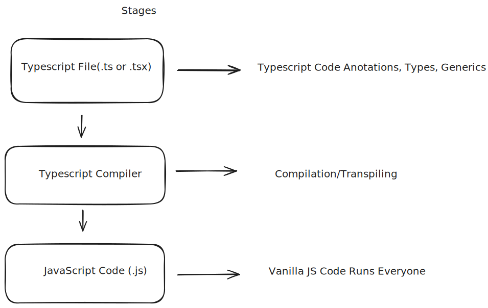

### Pratical Typescript 

#### Fundamentals 

- [Anotations Type](/fundamentals/Fundamentals.md#TypeAnnotations)

- [TuplasAndEnums](/fundamentals/Fundamentals.md#TuplasAndEnums)

##### Resource 

- [Pratical Typescript - Course for Beginners](https://www.youtube.com/watch?v=JHEB7RhJG1Y&t=31000s)
- [Documentation](https://www.typescriptlang.org/docs)

